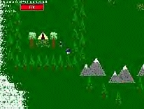



## Megalodon RPG Engine\(Tile\-Engine\)

### Description

Basic 2D Top-Down RPG Engine. Not fastest or most efficient, but fairly simple to use. Read the Readme.txt for instructions on gameplay.
 
### More Info
 
There is a Map Editor, and a Object Editor that I will upload soon, or may already be updated by the time you read this.

Based off of Lucky's Simple Tile Engine. Read the Readme.txt for gameplay instructions.

Extreme happyness:)

             |
---                |---
**Submitted On**   |2001-08-19 12:10:04
**By**             |[Patrick Rogers\-Ostema](https://github.com/Planet-Source-Code/PSCIndex/blob/master/ByAuthor/patrick-rogers-ostema.md)
**Level**          |Intermediate
**User Rating**    |5.0 (15 globes from 3 users)
**Compatibility**  |VB 6\.0
**Category**       |[Games](https://github.com/Planet-Source-Code/PSCIndex/blob/master/ByCategory/games__1-38.md)
**World**          |[Visual Basic](https://github.com/Planet-Source-Code/PSCIndex/blob/master/ByWorld/visual-basic.md)
**Archive File**   |[Megalodon 273921022001\.zip](https://github.com/Planet-Source-Code/patrick-rogers-ostema-megalodon-rpg-engine-tile-engine__1-27736/archive/master.zip)

